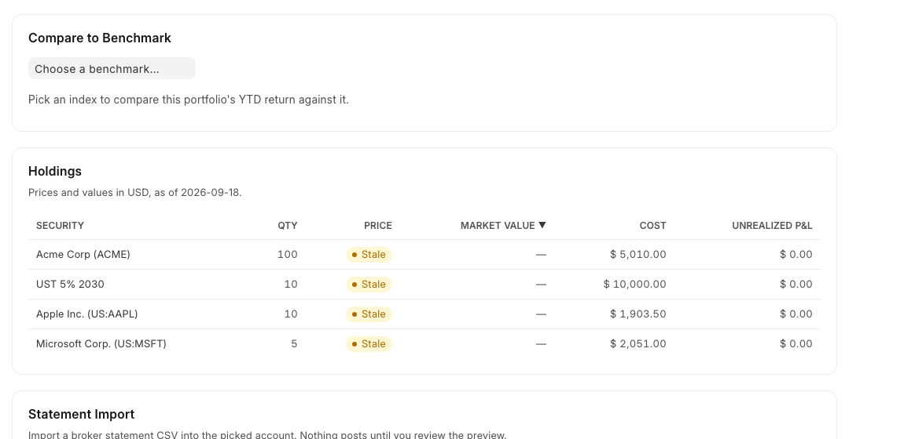
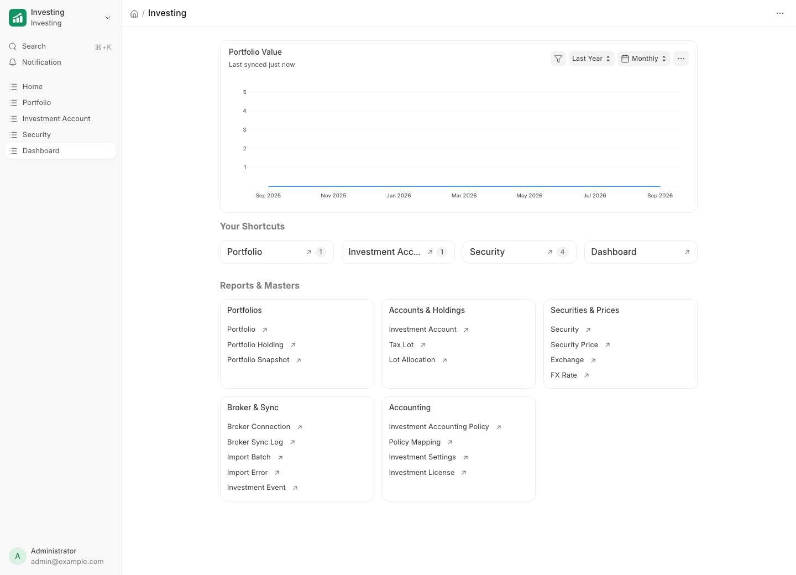
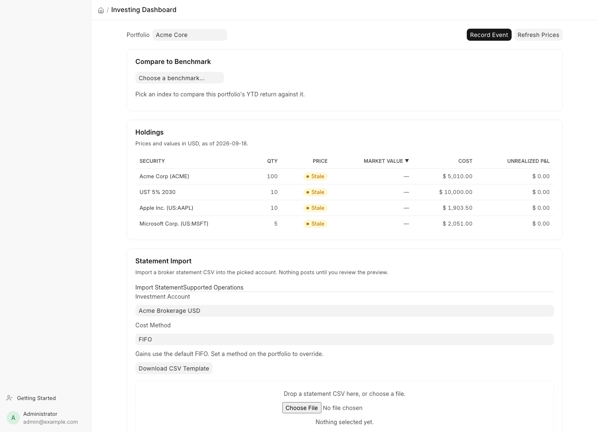
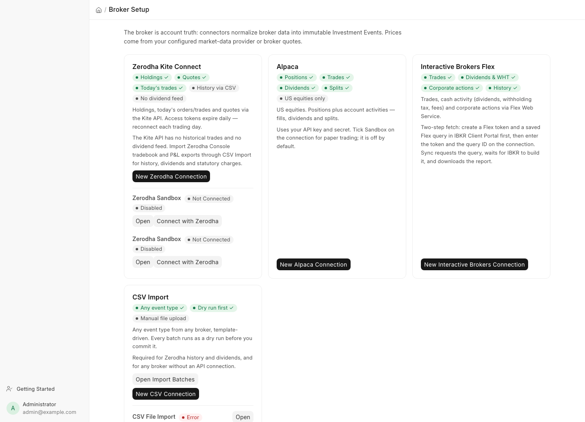
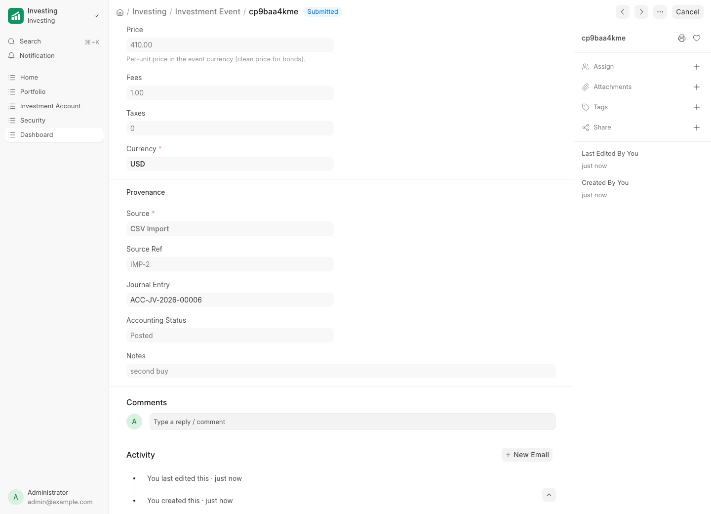
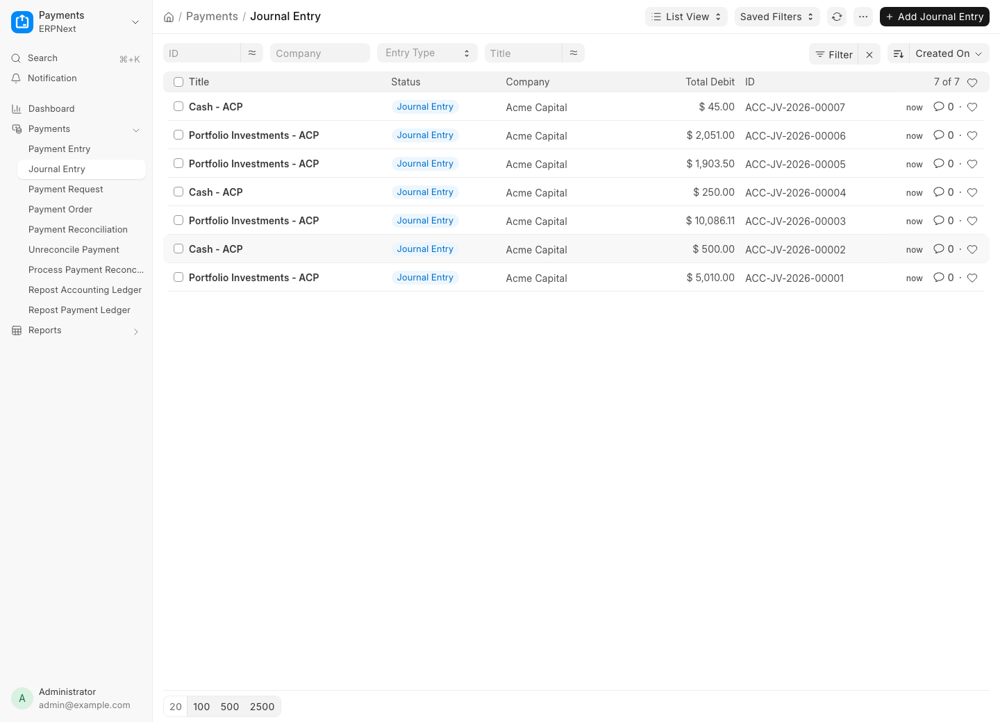
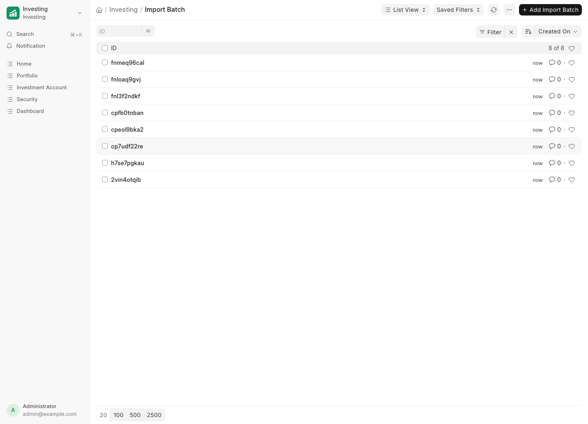

	
	<h1>Investing</h1>
	
<strong>Open source investment management for ERPNext</strong>

**[Documentation](docs/architecture.md)** · **[Tiers & Licensing](docs/tiers.md)** · **[Verification](docs/verification.md)**

> **Unofficial.** This is a community app, not affiliated with or endorsed by Frappe or ERPNext.

---

## Investing

Investing is a comprehensive investment management system for ERPNext. Track stocks, ETFs, bonds, funds and crypto with an auditable, event-sourced ledger. Every position is derived from immutable investment events, every profit and loss traces back to its tax lots, and every accounting entry follows your own accounting policy. Built for finance teams, family offices and businesses that hold investments on their ERPNext books.

## Key Features

- **Portfolios & Accounts**: group broker accounts into portfolios per company, in any base currency, with multi-currency valuation through explicit FX rates.
- **Automatic Broker Sync**: Zerodha (Kite Connect), Alpaca and Interactive Brokers (Flex Web Service), plus a generic CSV importer for everything else.
- **Every Event Accounted For**: buys, sells, dividends, bond coupons, fees, deposits, withdrawals, transfers, splits, reverse splits, stock dividends, spin-offs, cash-in-lieu and redemptions.
- **Tax Lots, Your Way**: FIFO, LIFO, average cost or specific identification, with realized P&L computed per allocation.
- **Corporate Actions Done Right**: a 4-for-1 split keeps your total cost basis exact; spin-offs allocate basis explicitly; fractional shares settle through cash-in-lieu.
- **Performance that Respects Cash Flows**: daily snapshots, time-weighted return, money-weighted XIRR, Sharpe ratio, and comparison against popular benchmarks (S&P 500, Nasdaq 100, Nifty 50, Nikkei 225, EURO STOXX 50, KOSPI, SSE).
- **Real ERPNext Accounting**: an Investment Accounting Policy maps each event type to your chart of accounts; journal entries post idempotently and cancel with their events.
- **Fixed Income, Properly**: coupon schedules, accrued interest (30/360, ACT/ACT), clean/dirty prices, yield-to-maturity and redemption at maturity.

## See It Working

Everything below is the app running on a live ERPNext v16 site after a 13-scenario,
52-check test fleet drove it end to end. No mockups; the receipts are in
[Verification](docs/verification.md).

| | |
|---|---|
|  |  |
| *The workspace: native Desk navigation, shortcuts and charts.* | *The dashboard: holdings with staleness flags, statement import, broker status.* |
|  |  |
| *Four connectors with honest capability badges.* | *Every event links its submitted journal entry.* |
|  |  |
| *Trades and income land in your chart of accounts.* | *CSV batches dry-run first; nothing posts unreviewed.* |

**Demo videos** (WebM, recorded on the same live site):

- [Record a trade end to end](docs/videos/manual-trade.webm): a manual sell from the
  dashboard, through its Investment Event, to the submitted Journal Entry.
- [Import a broker CSV](docs/videos/csv-import.webm): drop a statement, review the
  preview, post it, and see the batch.

## Tiers
| | Free | Pro |
|---|---|---|
| Every connector, corporate action, tax-lot method, report and the accounting integration | ✓ | ✓ |
| Stocks, ETFs, bonds, funds and crypto | ✓ | ✓ |
| **Asset classes tracked at once** | **1** | **unlimited** |

One paid plan, and it covers everything. Both tiers have every feature; they differ only in how many asset classes you track at once.

On Frappe Cloud there is nothing to install: pick a plan and the app reads it back from your subscription, so changing plans just works. Self-hosted sites activate with an offline-signed license key, verified locally with no data leaving your site. Open source means this is a commercial control, not DRM; see [Tiers & Licensing](docs/tiers.md) for the honest version.

## Under the Hood

1. **[ERPNext](https://github.com/frappe/erpnext)**: the open source ERP your investment accounting posts into.
2. **[Frappe Framework](https://github.com/frappe/frappe)**: a full-stack web application framework written in Python and JavaScript.

## Documentation

- [Architecture: events, lots, performance, accounting](docs/architecture.md)
- [Broker connectors and their honest limits](docs/connectors.md)
- [Market data and FX](docs/market-data.md)
- [Accounting policies](docs/accounting.md)
- [Tiers and licensing](docs/tiers.md)
- [Operations and upgrades](docs/operations.md)
- [Verification record](docs/verification.md)

## Contributing

1. [Issue Guidelines](https://github.com/frappe/erpnext/wiki/Issue-Guidelines)
2. [Report Security Vulnerabilities](https://erpnext.com/security)
3. [Pull Request Requirements](https://github.com/frappe/erpnext/wiki/Contribution-Guidelines)

## License

MIT; see [LICENSE](LICENSE). Not affiliated with Zerodha, Alpaca, Interactive Brokers, Frappe or any market-data provider; broker and exchange names belong to their owners. Nothing here is investment advice.

	

